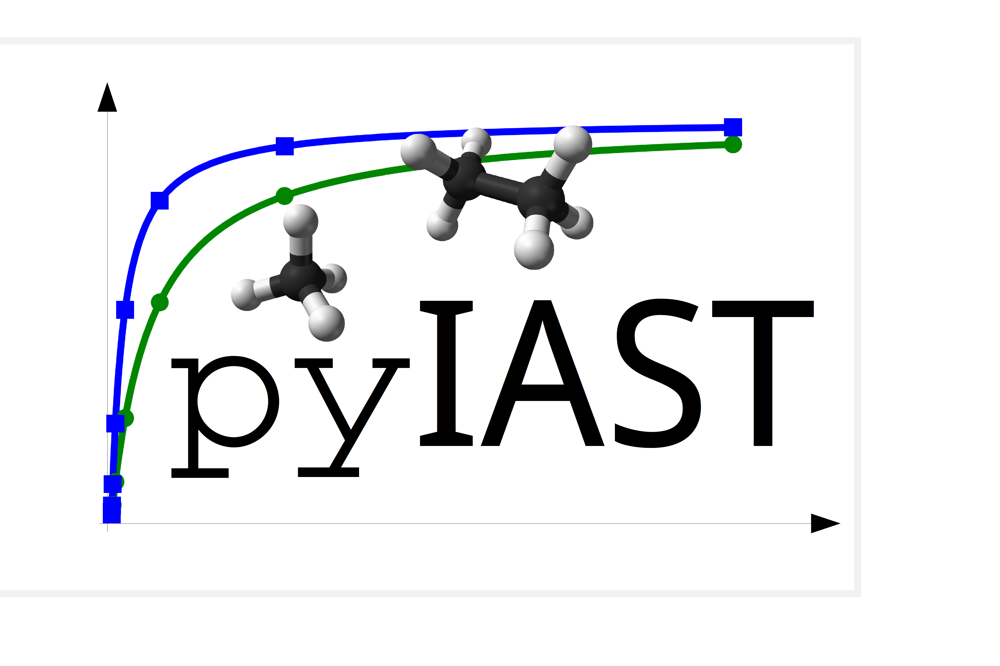

# pyIAST
### Python package for Ideal Adsorbed Solution Theory

pyIAST predicts mixted-gas adsorption isotherms in a nanoporous material from pure-component gas adsorption isotherms using Ideal Adsorbed Solution Theory (IAST).

[Documentation for pyIAST is here.](http://pyiast.readthedocs.org/en/latest/)

If you used pyIAST in your research, please cite our manuscript:

:point_right: C. Simon, B. Smit, M. Haranczyk. (2016) pyIAST: Ideal Adsorbed Solution Theory (IAST) Python Package. *Computer Physics Communications*. 200, pp.364-380. [DOI](http://dx.doi.org/doi:10.1016/j.cpc.2015.11.016) [Preprint](manuscript.pdf)
