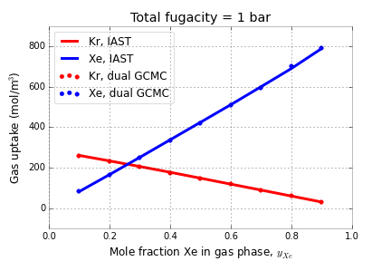

.. IAST documentation master file, created by
   sphinx-quickstart on Thu May 28 12:45:03 2015.
   You can adapt this file completely to your liking, but it should at least
   contain the root `toctree` directive.

Documentation for pyIAST
========================

This Python package, `pyIAST <https://github.com/CorySimon/pyIAST>`_, takes pure-component gas adsorption isotherms in a nanoporous material and predicts mixture isotherms using the Ideal Adsorbed Solution Theory (IAST).

pyIAST has five options to characterize the pure-component adsorption isotherms from a set of simulated or experimental data points:

1. Fit a Langmuir isotherm model
2. Fit a quadratic isotherm model
3. Fit a BET isotherm model
4. Fit a Sips isotherm model
5. Use linear interpolation (numerical quadrature for spreading pressures)

If you would like an additional model implemented, submit an issue on `Github <https://github.com/CorySimon/pyIAST>`_.

============
Installation
============

To install pyIAST, use the Python package manager `pip <https://pypi.python.org/pypi/pip?>`_:

.. code-block:: bash
   
   sudo pip install pyIAST

pyIAST runs on Python 2.6 and 2.7. 

If you are new to Python, I highly recommend working in the `IPython Notebook <http://ipython.org/notebook.html>`_; test scripts and tutorials for this code are written in IPython Notebooks. The instructions for getting started with Python for scientific computing are `here <http://ipython.org/install.html>`_.

As an alternative method to install pyIAST, clone the repository on `Github <https://github.com/CorySimon/pyIAST>`_. `cd` into the main directory `pyIAST` and run the `setup.py` script in the terminal:

.. code-block:: bash
   
   python setup.py install

If on Windows, you can run the setup file from a command prompt (Start --> Accessories):

.. code-block:: bash

   setup.py install

===
Use
===

Start up a Python 2.6 or 2.7 shell. I strongly recommend using `IPython Notebook <http://ipython.org/notebook.html>`_. For this tutorial on pyIAST, enter the `/XeKrtest` directory. We test pyIAST code with a binary mixture of Xe and Kr in IRMOF-1.

Simulated pure-component adsorption isotherms at 298 K (from single componenent grand-canonical Monte Carlo) are present in the files:

- `IRMOF-1_clean_Xe_isotherm_298K.csv`
- `IRMOF-1_clean_Kr_isotherm_298K.csv`

We simulated binary mixture isotherms of Xe/Kr in IRMOF-1 at 1 bar total pressure and 298 K at different mixture conditions using dual-component grand-canonical Monte Carlo. This data is present in `mixture_Xe_Kr_IRMOF-1_clean_298K.csv`. In this tutorial, we use pyIAST to reproduce this result.

First, import the `IAST` package:

.. code-block:: python

   import IAST

---------------------------------------
Import the pure-component isotherm data
---------------------------------------

Use the `Pandas` package (`documentation for Pandas <http://pandas.pydata.org/>`_) to load the pure-component adsorption isotherms as DataFrames:

.. code-block:: python
    
    import pandas as pd
    df_Xe = pd.read_csv("IRMOF-1_Xe_isotherm_298K.csv")
    df_Kr = pd.read_csv("IRMOF-1_Kr_isotherm_298K.csv")

The units for pressure and loading in both DataFrames must be consistent; loading of gas must be in a molar quantity for IAST to apply (e.g. mmol/g or mmol/cm\ :superscript:`3`). The `IAST` package will then work with these units throughout. 

To load data into a Pandas DataFrame that is of a different format, see the `documentation for Pandas <http://pandas.pydata.org/>`_.

-----------------------------------------
Construct pure-component isotherm objects
-----------------------------------------

We separate the process of characterizing the pure-component adsorption isotherms from performing IAST calculations. Construct the pure-component adsorption isotherm models by passing the DataFrame with the pure-component adsorption isotherm and the names of the columns that correspond to the loading and pressure. The data fitting is done under the hood when these objects are constructed.

* Langmuir isotherm model

.. code-block:: python

    xe_isotherm = IAST.LangmuirIsotherm(df_Xe, 
                                        loading_key="Loading(mol/m3)", 
                                        pressure_key="Pressure(bar)")
    kr_isotherm = IAST.LangmuirIsotherm(df_Kr, 
                                        loading_key="Loading(mol/m3)", 
                                        pressure_key="Pressure(bar)")

You may access the model parameters identified by least squares fitting by:

.. code-block:: python

   xe_isotherm.M  # saturation loading (units: mol/m3 here)
   xe_isotherm.K  # Langmuir constant (units : 1/bar here)

or print them automatically by:

.. code-block:: python
   
   xe_isotherm.print_params()

* Quadratic isotherm model

.. code-block:: python

    xe_isotherm = IAST.QuadraticIsotherm(df_Xe, 
                                         loading_key="Loading(mol/m3)", 
                                         pressure_key="Pressure(bar)")
    kr_isotherm = IAST.QuadraticIsotherm(df_Kr, 
                                         loading_key="Loading(mol/m3)", 
                                         pressure_key="Pressure(bar)")

You may see the model parameters identified by least squares fitting by:

.. code-block:: python

   xe_isotherm.M  # half of saturation loading (units: mol/m3 here)
   xe_isotherm.Ka  # isotherm constant (units : 1/bar here)
   xe_isotherm.Kb  # isotherm constant (units : 1/bar^2 here)

* BET isotherm model

.. code-block:: python

    xe_isotherm = IAST.BETIsotherm(df_Xe, 
                                        loading_key="Loading(mol/m3)", 
                                        pressure_key="Pressure(bar)")
    kr_isotherm = IAST.BETIsotherm(df_Kr, 
                                        loading_key="Loading(mol/m3)", 
                                        pressure_key="Pressure(bar)")
* Sips isotherm model

.. code-block:: python

    xe_isotherm = IAST.SipsIsotherm(df_Xe, 
                                        loading_key="Loading(mol/m3)", 
                                        pressure_key="Pressure(bar)")
    kr_isotherm = IAST.SipsIsotherm(df_Kr, 
                                        loading_key="Loading(mol/m3)", 
                                        pressure_key="Pressure(bar)")

* Linear interpolation model

The linear interpolation model has an additional, optional argument `fill_value` that tells us what loading to assume when we attempt to extrapolate beyond the data point with the highest pressure. In this example, we assume that the loading at the highest pressure point is equal to the saturation loading. By default, `fill_value=None` and an error is thrown when the IAST code tries to extrapolate loading beyond the highest pressure point in the pure-component adsorption isotherm.

.. code-block:: python

    xe_isotherm = IAST.InterpolatorIsotherm(df_Xe, 
                                            loading_key="Loading(mol/m3)", 
                                            pressure_key="Pressure(bar)", 
                                            fill_value=df_Xe["Loading(mol/m3)"].max())
    kr_isotherm = IAST.InterpolatorIsotherm(df_Kr, 
                                            loading_key="Loading(mol/m3)", 
                                            pressure_key="Pressure(bar)", 
                                            fill_value=df_Kr["Loading(mol/m3)"].max())

Once an isotherm model is constructed, we can view the fit of the isotherm model to the data by:

.. code-block:: python

   IAST.plot_isotherm(xe_isotherm)
   
The plot can be rendered on the log-scale by passing options `xlogscale=True` and/or `ylogscale=False`.

Using the adsorption isotherm objects, we can calculate the predicted loading at a new pressure, for example 1.0, by:

.. code-block:: python

   xe_isotherm.loading(1.0)
   
or the reduced spreading pressure via:

.. code-block:: python

   xe_isotherm.spreading_pressure(1.0)

-----------------------
Peform IAST calculation
-----------------------

Given the pure-component isotherm models, we now illustrate how to use IAST to predict gas uptake when the material is in equilibrium with a *mixture* of gases.

As an example, given the pure-component adsorption isotherm objects `xe_isotherm` and `kr_isotherm` above, we seek the loading [at the same temperature as the pure-component isotherms] in the presence of a 20/80 mol% Xe/Kr mixture at a pressure of 1.0 bar. The code for this is:

.. code-block:: python
    
    # list/array of partial pressures 
    # (same units as in pure-component isotherms)
    p = [.2, .8]  
    # Perform IAST calculation. returns component loadings.
    q = IAST.IAST(p, [xe_isotherm, kr_isotherm], verboseflag=True)

which will return `q`, an array of component loadings at these mixture conditions predicted by IAST. Entry 0 will correspond to Xe; entry 1 will correspond to Kr.

------------------------
Reverse IAST calculation
------------------------

In reverse IAST, we specify the mole fractions of gas in the *adsorbed* phase and the total bulk gas pressure, then calculate the bulk gas composition that yields these adsorbed mole fractions. This is useful e.g. in catalysis, where one seeks to control the composition of gas adsorbed in the material.

As an example,  given the pure-component adsorption isotherm objects `xe_isotherm` and `kr_isotherm` above, we seek the bulk gas composition [at the same temperature as the pure-component isotherms] that will yield a 20/80 mol% Xe/Kr mixture in the *adsorbed phase* at a total bulk gas pressure of 1.0. The code for this is:

.. code-block:: python
    
    P_total = 1.0
    z = [.2, .8]  # list/array of desired mole fractions in adsorbed phase
    y, q = IAST.reverse_IAST(z, P_total, [xe_isotherm, kr_isotherm])

which will return `y`, the required bulk gas phase mole fractions, and `q`, an array of component loadings at these mixture conditions predicted by IAST. Entry 0 will correspond to Xe; entry 1 will correspond to Kr.

======
Theory
======

Ideal Adsorbed Solution Theory was developed by Myers and Prausnitz:

Myers, A. L., & Prausnitz, J. M. (1965). Thermodynamics of mixed-gas adsorption. AIChE Journal, 11(1), 121-127.
    
In our IAST calculations, we follow the method outlined in the more accessible reference:

Tarafder, A. and Mazzotti, M. A method for deriving explicit binary isotherms obeying ideal adsorbed solution theory. Chem. Eng. Technol. 2012, 35, No. 1, 102-108.

=====
Tests
=====

This code was tested using pure-component Xe and Kr adsorption isotherms in IRMOF-1 to predict the uptake of Xe and Kr at 1 bar in a variety of Xe mole fractions. The test is displayed in `this IPython notebook <https://github.com/CorySimon/pyIAST/blob/master/XeKrtest/Test.ipynb>`_, and the files for reproduction of this result are in the `/XeKrtest` directory.

**TL;DR** The following plot shows the simulated Xe/Kr adsorption (points) using binary grand-canonical Monte Carlo simulations against the IAST prediction from pure-component adsorption isotherms (solid lines).

Tests are also available for a mixture of methane and ethane in `this IPython Notebook <https://github.com/CorySimon/pyIAST/blob/master/test/Methane%20and%20ethane%20test.ipynb>`_.

===============================
Class documentation and details
===============================

.. automodule:: isotherms
   :special-members:
   :members:

.. currentmodule:: isotherms

.. autofunction:: plot_isotherm

.. automodule:: IAST
   :special-members:
   :members:

Indices and tables
==================

* :ref:`genindex`
* :ref:`modindex`
* :ref:`search`

