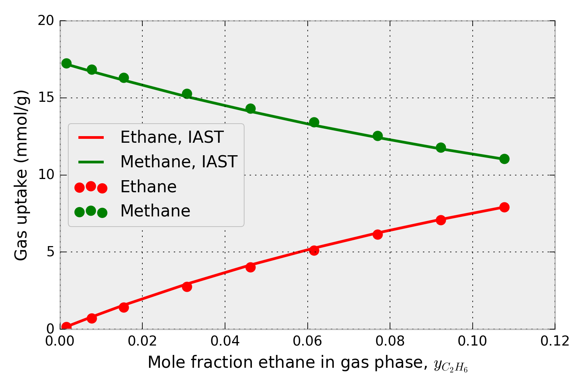

Documentation for pyIAST
========================

This Python package, `pyIAST <https://github.com/CorySimon/pyIAST>`_, predicts mixed-gas adsorption isotherms from a set of pure-component gas adsorption isotherms in a nanoporous material using Ideal Adsorbed Solution Theory (IAST).

pyIAST characterizes a pure-component adsorption isotherm from a set of simulated or experimental data points by:

(i) fitting an analytical model to the data [e.g., Langmuir, quadratic, BET, Sips, or Dual-site Langmuir Freundlich].

(ii) linearly interpolating the data.

Then, pyIAST performs IAST calculations to predict the mixed-gas adsorption isotherms on the basis of these pure-component adsorption isotherm characterizations.

pyIAST can handle an arbitrary number of components.

Please see our article for theoretical details and consider citing our article if you used pyIAST in your research:

    \C. Simon, B. Smit, M. Haranczyk. pyIAST: Ideal Adsorbed Solution Theory (IAST) Python Package. Submitted to Computer Physics Communications.

------------

For example, consider that we have pure-component methane and ethane adsorption isotherms in metal-organic framework IRMOF-1 at 298 K, shown in Fig. 1.

.. figure:: ../test/pure_component_isotherms.png
   :alt: pure-component methane and ethane adsorption isotherms in IRMOF-1.
   :figwidth: 60%
   :align: center

   Figure 1. Pure-component methane and ethane adsorption isotherms -- the amount of gas adsorbed as a function of pressure-- in metal-organic framework IRMOF-1. Simulated data.

Using the pure-component isotherm data in Fig. 1, pyIAST can predict the methane and ethane uptake in IRMOF-1 in the presence of a *mixture* of ethane and methane at 298 K under a variety of compositions. For example, for a mixture at 65.0 bar, Fig. 2 shows that the mixed-gas adsorption isotherms in IRMOF-1 predicted by pyIAST (lines) agree with binary component Grand-canonical Monte Carlo simulations (points).

   Figure 2. Methane and ethane adsorption in IRMOF-1 in the presence of a mixture of methane and ethane at 65.0 bar and 298 K. The x-axis shows the composition of ethane in the mixture. The data points are from binary grand-canonical Monte Carlo simulations; the lines are from pyIAST.

To ask a question, request an additional feature, report a bug, or suggest an improvement, submit an issue on `Github <https://github.com/CorySimon/pyIAST>`_ or discuss on `Gitter <https://gitter.im/CorySimon/pyIAST?>`_.

============
Installation
============

To install pyIAST, use the Python package manager `pip <https://pypi.python.org/pypi/pip?>`_:

.. code-block:: bash
   
   sudo pip install pyiast

pyIAST runs on Python 2.6 and 2.7. 

As an alternative method to install pyIAST, clone the repository on `Github <https://github.com/CorySimon/pyIAST>`_. `cd` into the main directory `pyIAST` and run the `setup.py` script in the terminal:

.. code-block:: bash
   
   sudo python setup.py install

If on Windows, run the setup file from a command prompt (Start --> Accessories):

.. code-block:: bash

   setup.py install

==============
New to Python?
==============

If new to Python, I *highly* recommend working in the `IPython Notebook <http://ipython.org/notebook.html>`_; test scripts and tutorials for this code are written in IPython Notebooks. The instructions for getting started with Python for scientific computing are `here <http://ipython.org/install.html>`_.

===============
pyIAST tutorial
===============

For this tutorial on pyIAST, enter the `/test` directory of pyIAST. While you can type this code into the Python shell, I highly recommend instead opening an `IPython Notebook <http://ipython.org/notebook.html>`_. First, import pyIAST into Python after installation.

.. code-block:: python

   import pyiast

For our tutorial, we have the pure-component methane and ethane adsorption isotherm data for metal-organic framework IRMOF-1 in Fig 1. We seek to predict the methane and ethane uptake in the presence of a binary mixture of methane and ethane in IRMOF-1 at the same temperature. As an example for this tutorial, we seek to predict the methane and ethane uptake of IRMOF-1 in the presence a 5/95 mol % ethane/methane mixture at a total pressure of 65.0 bar and 298 K.

---------------------------------------
Import the pure-component isotherm data
---------------------------------------

First, we load the pure-component isotherm data into Python so we can pass it into pyIAST. The data in Fig. 1 (from single component grand-canonical Monte Carlo simulations) are present in the `CSV <https://en.wikipedia.org/wiki/Comma-separated_values>`_ files:

- `IRMOF-1_ethane_isotherm_298K.csv`
- `IRMOF-1_methane_isotherm_298K.csv`

To import this data into Python, use the `Pandas` package (`documentation for Pandas <http://pandas.pydata.org/>`_). The following code will return a Pandas `DataFrame <http://pandas.pydata.org/pandas-docs/stable/dsintro.html#dataframe>`_ instance, which is useful for storing and manipulating tabular data.

.. code-block:: python
    
    import pandas as pd
    df_ch4 = pd.read_csv("IRMOF-1_methane_isotherm_298K.csv")
    df_ch3ch3 = pd.read_csv("IRMOF-1_ethane_isotherm_298K.csv")

You can check that your data has loaded correctly by looking at the head of the DataFrame:
    
.. code-block:: python

   df_ch4.head()

The units for pressure and loading in both DataFrames must be consistent; loading of gas must be in a molar quantity for IAST to apply (e.g. mmol/g or mmol/cm\ :superscript:`3`). pyIAST will then work with these units throughout.

To load data into a Pandas DataFrame that is not `CSV`, see the `documentation for Pandas <http://pandas.pydata.org/>`_. Pandas is generally a very useful tool for manipulating data. See `10 Minutes to pandas <http://pandas.pydata.org/pandas-docs/stable/10min.html>`_.

-----------------------------------------
Construct pure-component isotherm objects
-----------------------------------------

Next, we use pyIAST to translate the pure-component methane and ethane adsorption isotherm data into a model, which we will subsequently feed into pyIAST's IAST calculator.

There are two different pure-component isotherm data characterizations in pyIAST: 

1. `pyiast.ModelIsotherm` 
2. `pyiast.InterpolatorIsotherm` 

In the first, an analytical model (e.g. Langmuir) is fit to the data, and the isotherm thereafter is characterized by this fitted analytical model. In the second, pyIAST linearly interpolates the data and uses numerical quadrature to compute the spreading pressure, which is an integration involving the isotherm for IAST calculations.

Note that pyIAST allows you to mix isotherm models for an IAST calculation (e.g. use Langmuir for methane but interpolate for ethane).

For both `ModelIsotherm` and `InterpolatorIsotherm`, we construct the instance by passing the Pandas DataFrame with the pure-component adsorption isotherm data and the names of the columns that correspond to the loading and pressure.

ModelIsotherm
^^^^^^^^^^^^^

Here, in the construction of the instance of a `ModelIsotherm`, the data fitting to the analytical model is done under the hood. As an example, to construct a `ModelIsotherm` using the Langmuir adsorption model for methane (see Fig. 1), we pass the DataFrame `df_ch4` and the names (keys) of the columns that correspond to the loading and pressure. In `IRMOF-1_methane_isotherm_298K.csv`, the name of the loading and pressure column is `Loading(mmol/g)` and `Pressure(bar)`, respectively. (e.g., in Pandas, `df_ch4['Pressure(bar)']` will return the column corresponding to the pressure.)

.. code-block:: python

    ch4_isotherm = pyiast.ModelIsotherm(df_ch4,
                                        loading_key="Loading(mmol/g)", 
                                        pressure_key="Pressure(bar)",
                                        model="Langmuir")

A Langmuir model has been fit to the data in `df_ch4`. You can access a dictionary of the model parameters identified by least squares fitting to the data by:

.. code-block:: python

    ch4_isotherm.params  # dictionary of identified parameters
    # {'K': 0.021312451202830915, 'M': 29.208535025975138}

or print them:

.. code-block:: python
    
    ch4_isotherm.print_params()  # print parameters
    # Langmuir identified model parameters:
    #    K = 0.021312
    #    M = 29.208535
    # RMSE = 0.270928487851

pyIAST will plot the isotherm data points and resuling model fit by:

.. code-block:: python

   pyiast.plot_isotherm(ch3ch3_isotherm)

To predict the loading at a new pressure using the identified model, for example at 40.0 bar, one can call:

.. code-block:: python

    ch4_isotherm.loading(40.0)  # returns predicted loading at 40 bar.
    # 13.441427980586377 (same units as in df_ch4, mmol/g)

or the reduced spreading pressure (used for IAST calculations) via:

.. code-block:: python

    ch4_isotherm.spreading_pressure(40.0)
    # 18.008092685521699 (mmol/g)

pyIAST fits other models (see the list `pyiast._MODELS` for available models), for example, the quadratic isotherm model, by passing `model="Quadratic"` into the construction of the `ModelIsotherm` instance.

A nonlinear data-fitting routine is used in pyIAST to fit the model parameters to the data. pyIAST uses heuristics for starting guesses for these model parameters. But, you can pass your own parameter guesses in the form of a dictionary `param_guess` when you construct the instance. For example, to use 25.0 as a starting guess for the `M` parameter in the Langmuir model:

.. code-block:: python
    
    ch4_isotherm = pyiast.ModelIsotherm(df_ch4,
                                        loading_key="Loading(mmol/g)", 
                                        pressure_key="Pressure(bar)",
                                        model="Langmuir",
                                        param_guess={"M": 25.0})

You may need to pass your own starting guess for the parameters if the default guesses in pyIAST were not good enough for convergence when solving the nonlinear equations of IAST. You can see the naming convention for model parameters in pyIAST in the dictionary `pyiast._MODEL_PARAMS` as well as in the documentation for the `ModelIsotherm` class at the end of this page. Further, you can change the method used to solve the IAST equations by passing e.g. `optimization_method="Powell"` if you encounter convergence problems. For a list of optimization methods, see the `Scipy website <http://docs.scipy.org/doc/scipy/reference/optimize.html#module-scipy.optimize>`_.

InterpolatorIsotherm
^^^^^^^^^^^^^^^^^^^^

The `InterpolatorIsotherm`, where pyIAST linearly interpolates the isotherm data, is constructed very similary to the `ModelIsotherm`, but now there is not a need to pass a string `model` to indicate which model to use.

.. code-block:: python

    ch4_isotherm = pyiast.InterpolatorIsotherm(df_ch4,
                                        loading_key="Loading(mmol/g)", 
                                        pressure_key="Pressure(bar)")

This `InterpolatorIsotherm` object behaves analogously to the `ModelIsotherm`; for example `ch4_isotherm.loading(40.0)` returns the loading at 40.0 bar via linear interpolation and `pyiast.plot_isotherm(ch4_isotherm)` still plots the isotherm and linear interpolation. When we attempt to extrapolate beyond the data point with the highest pressure, the `ch4_isotherm` above will throw an exception.

The `InterpolatorIsotherm` has an additional, optional argument `fill_value` that tells us what loading to assume when we attempt to extrapolate beyond the highest pressure observed in the pure-component isotherm data. For example, if the isotherm looks reasonably saturated, we can assume that the loading at the highest pressure point is equal to the largest loading in the data:

.. code-block:: python
    
    ch4_isotherm = pyiast.InterpolatorIsotherm(df_ch4,
                                        loading_key="Loading(mmol/g)", 
                                        pressure_key="Pressure(bar)",
                                        fill_value=df_ch4['Loading(mmol/g)'].max())
    ch4_isotherm.loading(500.0)  # returns 66.739250428032904

Should I use `ModelIsotherm` or `InterpolatorIsotherm`?
^^^^^^^^^^^^^^^^^^^^^^^^^^^^^^^^^^^^^^^^^^^^^^^^^^^^^^^

See the discussion in our manuscript:

C. Simon, B. Smit, M. Haranczyk. pyIAST: Ideal Adsorbed Solution Theory (IAST) Python Package. Submitted to Computer Physics Communications.

--------------------------
Peform an IAST calculation
--------------------------

Given the pure-component isotherm characterizations constructed with pyIAST, we now illustrate how to use pyIAST to predict gas uptake when the material is in equilibrium with a *mixture* of gases. We have `ch4_isotherm` as above and an analogously constructed pure-component ethane adsorption isotherm object `ch3ch3_isotherm`.

As an example, we seek the loading in the presence of a 5/95 mol% ethane/methane mixture at a temperature of 298 K [the same temperature as the pure-component isotherms] and a total pressure of 65.0 bar. The function `pyiast.iast()` takes as input the partial pressures of the gases in the mixture and a list of the pure-component isotherms characterized by pyIAST. For convenience, we define the total pressure first as `total_pressure` and the gas phase mole fractions as `y`.

.. code-block:: python
    
    total_pressure = 65.0  # total pressure (bar)
    y = np.array([0.05, 0.95])  # gas mole fractions 
    # partial pressures are now P_total * y
    # Perform IAST calculation
    q = pyiast.iast(total_pressure * y, [ch3ch3_isotherm, ch4_isotherm], verboseflag=True)
    # returns q = array([4.4612935, 13.86364776])

The function `pyiast.iast()` returns `q`, an array of component loadings at these mixture conditions predicted by IAST. Since we passed the ethane partial pressures and isotherm first, entry 0 will correspond to ethane; entry 1 will correspond to methane. The flag `verboseflag` will print details of the IAST calculation. When the result required an extrapolation of the pressure beyond the highest pressure observed in the data, pyIAST will print a warning to the user. It may be necessary to collect pure-component isotherm data at higher pressures for the conditions in which you are interested (see our manuscript).

------------------------
Reverse IAST calculation
------------------------

In reverse IAST, we specify the mole fractions of gas in the *adsorbed* phase and the total bulk gas pressure, then calculate the bulk gas composition that yields these adsorbed mole fractions. This is useful e.g. in catalysis, where one seeks to control the composition of gas adsorbed in the material.

As an example, we seek the bulk gas composition [at 298 K, the same temperature as the pure-component isotherms] that will yield a 20/80 mol% ethane/methane mixture in the *adsorbed phase* at a total bulk gas pressure of 65.0. The code for this is:

.. code-block:: python
    
    total_pressure = 65.0  # total pressure (bar)
    x = [0.2, 0.8]  # list/array of desired mole fractions in adsorbed phase
    y, q = pyiast.reverse_iast(x, total_pressure, [ch3ch3_isotherm, ch4_isotherm])
    # returns (array([ 0.03911984,  0.96088016]), array([  3.62944368,  14.51777472]))

which will return `y`, the required bulk gas phase mole fractions, and `q`, an array of component loadings at these mixture conditions predicted by IAST. Entry 0 will correspond to ethane; entry 1 will correspond to methane.

------------

A variant of this tutorial, where we generate Fig. 2, is available in `this IPython Notebook <https://github.com/CorySimon/pyIAST/blob/master/test/Methane%20and%20ethane%20test.ipynb>`_.

======
Theory
======

Ideal Adsorbed Solution Theory was developed by Myers and Prausnitz:

    \A. L. Myers and J. M. Prausnitz (1965). Thermodynamics of mixed-gas adsorption. AIChE Journal, 11(1), 121-127.
    
In our IAST calculations, we follow the method to solve the equations outlined in the more accessible reference:

    \A. Tarafder and M. Mazzotti. A method for deriving explicit binary isotherms obeying ideal adsorbed solution theory. Chem. Eng. Technol. 2012, 35, No. 1, 102-108.

We provide an accessible derivation of IAST and discuss practical issues in applying IAST in our manuscript:

    \C. Simon, B. Smit, M. Haranczyk. pyIAST: Ideal Adsorbed Solution Theory (IAST) Python Package. Submitted to Computer Physics Communications.

=====
Tests
=====

In the `/test` directory, you will find IPython Notebooks that test pyIAST in
various ways.

---------------------------
Methane/ethane mixture test
---------------------------

'test/Methane and ethane test.ipynb`

This IPython Notebook compares pyIAST calculations to binary component
grand-canonical Monte Carlo simulations for a methane/ethane mixture. This
notebook reproduces Fig. 2, which confirms that pyIAST yields component loadings
consistent with the binary grand-canonical Monte Carlo simulations.

----------------------
Isotherm fitting tests
----------------------

`test/Isotherm tests.ipynb`

This IPython Notebook generates synthetic data for each isotherm model, stores
the data in a Pandas DataFrame, and uses pyIAST to construct a `ModelIsotherm`
using this data; this notebook checks for consistency between the identified
model parameters and those used to generate the synthetic data. This ensures
that the data fitting routine in pyIAST is behaving correctly.

-------------------------------
Competitive Langmuir adsorption
-------------------------------

`test/Test IAST for Langmuir case.ipynb`

In that case that the pure-component adsorption isotherm :math:`L_i(P)` for 
species :math:`i` follows a Langmuir isotherm with saturation loading :math:`M`
and Langmuir constant :math:`K_i`:

.. math::
   
   L_i(P) = M\frac{K_i P}{1+K_i P},

i.e. equal saturation loadings among all components, it follows from IAST that the
mixed gas adsorption isotherm :math:`N_i(p_i)` follows the competitive Langmuir model:

.. math::

   N_i(p_i) = M \frac{K_i p_i}{1+ \sum_j K_j p_j}.

In this IPython Notebook, we generate synthetic data that follows three
Langmuir adsorption isotherm models with the same saturation loading but
different Langmuir constants. We then use pyIAST to predict the mixed gas
adsorption isotherm and check that it is consistent with the competitive
Langmuir adsorption model above.

===============================
Class documentation and details
===============================

.. automodule:: isotherms
   :special-members:
   :members:

.. currentmodule:: isotherms

.. autofunction:: plot_isotherm

.. automodule:: pyiast
   :special-members:
   :members:

Indices and tables
==================

* :ref:`genindex`
* :ref:`modindex`
* :ref:`search`

